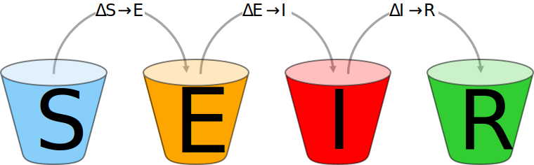

# Corona SEIR Workbench 
The [SARS-COV-2](https://en.wikipedia.org/wiki/Severe_acute_respiratory_syndrome_coronavirus_2) pandemic has been affecting our lives for months. The effectiveness of measures against the pandemic can be tested and predicted by using epidemiological models. The Corona SEIR Workbench uses a SEIR model and combines a graphical output of the results with a simple parameter input for the model. Modelled data can be compared country by country with the SARS-COV-2 infection data of the Johns Hopkins University. Additionally, the R₀ values of the Robert Koch Institute can be displayed for Germany.

## Current status of the COVID-19 pandemic
Since December 2019, the corona virus [SARS-COV-2](https://en.wikipedia.org/wiki/Severe_acute_respiratory_syndrome_coronavirus_2) and its [COVID-19](https://en.wikipedia.org/wiki/Coronavirus_disease_2019) disease has been keeping the world in suspense with a [pandemic](https://en.wikipedia.org/wiki/Pandemic).Although, the occurrence of a comparable pandemic was only a matter of time. It is estimated that similar pandemics occur every 20-30 years[1](#f1).

Yet today no vaccine against SARS-COV-2 is available comprehensively, many different non-medical measures are being used to defeat the pandemic. These range from everyday masks, distancing of people, closure of public institutions, sports facilities, bars and restaurants, up to contact restrictions, all with the aim of reducing the spread of virus particles. Test strategies and [contact tracing](https://en.wikipedia.org/wiki/Contact_tracing) should detect infected persons as soon as possible and then isolate them in a quarantine. All these measures are designed to control the occurrence of infection and yet have as few restrictions as possible for the population and as few as possible negative economic impacts.

Prerequisite for controlling the pandemic is a data base as good as possible. In Germany, this is generated by the  [Robert Koch-Institute](https://www.rki.de/) via the local health authorities. Internationally, the [Center for Systems Science and Engineering (CSSE)](https://systems.jhu.edu/) at Johns-Hopkins-University collects and publishes [SARS-COV-2 infection data](https://www.arcgis.com/apps/opsdashboard/index.html#/bda7594740fd40299423467b48e9ecf6).

The central goal of pandemic control is to avoid overburdening the health care system so that all those suffering from COVID 19 receive the best possible medical care. Moreover, the lowest possible infection rate is desirable to minimize the health consequences for the population.

On the basis of the data obtained, [epidemic models]https://en.wikipedia.org/wiki/Compartmental_models_in_epidemiology can make predictions about the infection process in the future. The number of infections grows exponentially. As a result, the rise in the number of patients can get out of hand quickly and overburden the healthcare system. Because of this, early intervention and a review of the measures taken are essential to control the pandemic.

## The SEIR Model
The [SEIR model](https://en.wikipedia.org/wiki/Compartmental_models_in_epidemiology) belongs to the class of compartment models that sort people into different compartments. The SEIR model divides the population into four compartments: "**S**usceptible" (people who are susceptible to an infection), "**E**xposed" (infected people during the incubation period), "**I**nfectious" (infectious people) and "**R**ecovered" (people who recovered from the disease or died):

Compartments of the SEIR model

During modeling, people move from one compartment to the next. The calculation takes place per time unit. Usually a single day is used as time unit.

At the beginning of the epidemic almost all persons are healthy and in the "Susceptible" compartment. All persons in this compartment can be infected with the corona virus. After an infection, a person moves to the "**E**xposed" compartment and remains there for the medium incubation period of the disease. At this time the person is not yet contagious to other people. A study[2](#f2) in January stated the mean incubation time as 5.2 days. A detailed discussion can be found in Byrne et al.[3](#f3).

As soon as the ill person distributes virus particles and can infect other people, he or she moves from the "**E**xposed" compartment to the "**I**nfectious" compartment. This "bucket" contains the people who are driving the pandemic. The infectious person remains in this compartment for the average infection time of 2.9 days[4](#f4).

The average infection time should not be confused with the maximum infection time, which plays a role in quarantining a sick person and can be up to 14 days. The mean duration of infection is also influenced by the diagnosis, as a symptomatic person is tested often at the onset of symptoms and then isolated.

After a person has survived the disease and is no longer infectious, the person moves from the "**I**nfectious" to the "**R**ecovered" compartment.  At this time, the person is immune to re-infection with SARS-COV-2. Another possible outcome is that the person might have died from COVID 19 disease. The SEIR model makes no distinction here and puts the person in both cases into the "**R**ecovered" compartment.

## Maths of the SEIR model
In the SEIR model, the change of all four compartments per time unit is calculated. In the first step, ΔS susceptible persons in compartment *S* are infected by infectious persons in compartment *I*. Determining factors are the number of infectious persons and the [basic reproduction number](https://en.wikipedia.org/wiki/Basic_reproduction_number) R₀:

For SARS-COV-2, an R₀ value of 3.4[5](#f5) was determined for an unrestricted virus spreading. This means that on average, one infected person infects 3.4 other susceptible persons. R₀ values greater than 1 result in an exponential growth of new infections, while an R₀ value less than 1 leads to a decreasing number of newly infected persons.

The change of infectious persons ΔE depends on the incubation period:

Therefore, the number of infectious persons increases with a certain time delay after they got infected.

After the disease has been overcome or the infectious person has been isolated, he or she moves to compartment *R*. The number ΔI depends on the average duration of infectiousness:

The symbols used in the equations represent the following values:

Die neuen Personenanzahlen *S‘*, *E‘*, *I‘* und *R‘* in den einzelnen Kompartimenten *S*, *E*, *I* und *R* nach einer Zeiteinheit kann nach folgenden Formeln berechnet werden:
The new numbers of persons *S‘*, *E‘*, *I‘* and *R'* in the compartments *S*, *E*, *I* and *R* after a time unit can be calculated with the following formulas:

## The Workbench
The goal of the Corona Workbench was to create an infrastructure for modelling an epidemic. In addition to the modelling, this includes the graphical output of results per time unit and an easy modification of modelling parameters. To compare the modelling with historical data, it should be possible to display population sizes, infection data and R₀ values in the same chart. In addition, the software should be easily extendable so that other models can be implemented without much effort.

### Architecture of the Workbench
We used a class-based approach with C# for the Corona SEIR Workbench, because individual components can be isolated easily and maintained much better this way. Furthermore, .Net offers a very good performance and C# has all the features of a high-level language with object-oriented and functional language elements. Using Linq, operations on sets of data can be programmed very easily.

For a graphical data output, we use the [Microsoft Windows Forms Charting](https://docs.microsoft.com/en-us/dotnet/api/system.windows.forms.datavisualization.charting)[6](#f6) Library, which comes with Visual Studio. The user interface was programmed in [XAML](https://en.wikipedia.org/wiki/Extensible_Application_Markup_Language) with the [Windows Presentation Foundation](https://en.wikipedia.org/wiki/Windows_Presentation_Foundation). Both were combined in a .Net Core 3.1 project.

In order to present data from as many countries as possible, we use the infection data from the [CSSE](https://systems.jhu.edu/) of the Johns-Hopkins-University. This data is aggregated by [Datopian](https://datahub.io/core/covid-19) on a daily basis by country. For historical R₀ values of Germany we use the daily [nowcasting values](https://www.rki.de/DE/Content/InfAZ/N/Neuartiges_Coronavirus/Projekte_RKI/Nowcasting_Zahlen.xlsx) published by the Robert Koch-Institute. We determine population data from the web API of the [World Bank](https://www.worldbank.org/). Data is downloaded from the web only once a day and then temporarily stored for further processing.

A Python-based approach to SEIR modelling for SARS-COV-2 has been published by Pina Merkert[7](#f7) in Heise c't magazine. The Python code can be found on [Github](https://github.com/pinae/SEIR-fit).

### Using the Workbench
The user interface should be as simple as possible and can be easily extended by C# programmers using Visual Studio. The main window is divided into three blocks:

Corona SEIR Workbench UI

In the upper area a diagram is shown. Data points are displayed per date on the horizontal axis. The left axis refers to case numbers while the right axis shows R₀ values. Data points for daily incidence are drawn as bars in the graph and boxes in the legend. Additionally, for modelled values of total cases, daily cases and mean 7-day case numbers, a rhombus is displayed when the values have doubled compared to the value of the current date. In the tooltip the data value and date are shown for the data point under the mouse pointer.

Below the diagram, individual curves can be hidden or shown in the "*Series*" area. The scaling of the axes is automatic, so that it usually makes sense to hide the SEIR curve of susceptible persons ("**S**usceptible") because of its large values.

The next parameters determine the country and the modelling period. Moreover, SEIR parameters can be set for the average incubation period, the mean infection period and the base reproduction number R₀. Changes of the parameters are applied immediately, the model is recalculated and results are displayed in the diagram.

Beside a constant R₀ value, the base reproduction number can be calculated from historical data. The calculation of the R₀ value is done by a "solver" component, which solves the SEIR model with a Levenberg-Marquardt[8](#f8) approach. The first "solver" calculates the R₀ value for each day considering a window of n days in the future. The larger this window gets the smoother the R₀ curve gets. In the second method, the R₀ value with the smallest deviation in the case numbers is calculated for a given interval of days. Both "solver" components use the largest R₀ value, which gives the smallest error if the errors of multiple R₀ values are identical.

Finally, from the last 5 days with historical data the average of the R₀ value is calculated and used for future calculations in the SEIR model. You can adjust this mean R₀ value manually to allow for infection control measures in the model.

In the lower part of the main window functions can be executed by buttons. "*Show Data*" displays a table with all data points from the chart. You can transfer them from the table to other applications like Microsoft Excel via the clipboard. With "*Export Chart*" you can export the chart in various formats or as a CSV file.

Your chart settings and SEIR model parameters can be saved with the "*Save Settings*" button. Saved settings are applied automatically during application start. The button "*Reset Settings*" resets all settings to their default values. Like the "*Reset Settings*", the "*Clear Settings*" button resets all settings, but hides all curves in the chart additionally. This function is convenient for creating your own charts because you don’t have to hide series first.

### Results of the Workbench
The simplest SEIR model with an unrestricted virus spread uses a constant base reproduction number of 3.4 for Germany.

SEIR model for Germany

In this case, almost the entire population would have been infected in April and May this year. However, the actual case numbers of the Johns-Hopkins-University for Germany show a different run of the curve:

Covid-19 cases of the Johns-Hopkins-Universität from 13th November 2020

The reason for the different trend can be explained by the R₀ values of the Robert Koch-Institute, which decreased from 3.4 to below 1.0 in April:

Covid-19 cases of the Johns-Hopkins-Universität from 13th November 2020 with R₀ values of the Robert Koch-Institute

The basic reproduction number has been significantly reduced by the nation-wide lockdown and contact bans in Germany. The peek in mid-June was probably caused by the high number of SARS-COV-2 infected people in the Gütersloh district caused by butchers' companies. This was a local outbreak and was contained quite quickly.

If R₀ values are calculated from historical data using the Levenberg-Marquardt[8](#f8) method, the SEIR model shows the same trend. The case numbers (yellow line) correspond to the historical infection series (red line) up to 13th November 2020, which is the current date. If the current R₀ value of 1.2 is assumed for the future, however, a further sharp increase is likely and a doubling of case numbers will occur in less than a month (yellow rhombus).

SEIR prediction with calculated R₀ base reproduction number

The calculated R₀ value in March is significantly higher than the value determined by the RKI. This is due to the low number of cases in February and early March. It is a fundamental weakness of the R₀ that the value shows high fluctuations when case numbers are very low. Thus, the average 7-day incidence number per 100,000 people was used as an assessment criterion during the summer.

SEIR 7-day incidence prediction from calculated R₀ base reproduction number

Again, the series of the Johns-Hopkins data correspond to the SEIR model. However, in this simulation a R₀ value of 0.9 was used for future values. This R₀ value is close to the 7-day R₀ value of November, the 8th of 2020 from the RKI nowcasting table. In this situation, the 7-day incidence value of 100.000 individuals would decrease below 100 cases per day at the beginning of December.

The different simulations show how critical the basic reproduction number is for the further development of the pandemic. A R₀ value above 1 is the driver of the epidemic.

### Class model of the Workbench
The Corona Workbench implements an interface-based class model for the SEIR models. Each SEIR model has an *ISEIR* interface which provides SEIR parameters and the number of people for the *S*, *E*, *I* and *R* compartments. The interface defines a Calc method which calculates model values for a certain number of days. The calculation of the compartments *S‘*, *E‘*, *I‘* and *R'* is done by using static functions and can be easily changed with these functions. The setup of the *ISEIR* model takes place in the constructor.

SEIR class model

A view takes care of the display of *ISEIR* data. The view can be either implememnt an *ISeriesView* interface for discrete time intervals or use an *IDateSeriesView* interface for a time range with start and end date. The *CalcAsync* method of the view calculates the model and stores individual data points in a chart data series. The *SEIRR0DateSeriesView* view allows the SEIR calculation with varying R₀ values for different dates.

Historical R₀ values are calculated by solver objects with an *IR0Solver* interface. The interface defines a *Solve* method, which returns a sequence of R₀ values. The *IR0Solver* interface is implemented by a *SEIRR0Solver* class, which compares for each day the calculated case numbers of the SEIR model with the actual case numbers and returns the optimal R₀ value for the day by using the Levenberg-Marquardt[8](#f8) method. As a simple approach, all R₀ values between 0 and 10 are calculated in steps of 0.1 and the largest R₀ value with the smallest deviation from the actual case numbers is returned.

Class model of the R₀ solver

Historical infection data from the Johns-Hopkins [Center for Systems Science and Engineering](https://systems.jhu.edu/) is retrieved by a *JHU* object and returned as data series via the *JHUDateSeiriesView* view. Since the data of the Johns-Hopkins-University is a unique algorithm, no interface was defined for the *JHU* class:

Classes for the loading of Johns-Hopkins CSSE data

The *JHU* object caches the retrieved data in a temporary CSV file and parses it as fast as possible.

The same approach is used by the *RKINowcasting* class, which downloads the [Nowcasting Excel file](https://www.rki.de/DE/Content/InfAZ/N/Neuartiges_Coronavirus/Projekte_RKI/Nowcasting_Zahlen.xlsx) of the [Robert Koch-Institute](https://www.rki.de/)  once a day and returns the columns "Point estimator of the reproduction number R", as well as "Point estimator of the 7-day R value" for dates.

Classes for the loading of Robert Koch-Institute Nowcasting data

The current population of a country is determined with the *WPPopulation* class via the [World-Bank API](https://data.worldbank.org/). 

## Discussion
The Corona SEIR Workbench provides a simple infrastructure for modelling epidemics. It uses standard components such as Windows Forms Charting for displaying charts and the Windows Presentation Foundation for the user interface. Current epidemiological data for COVID-19 can be downloaded from the web and compared with calculated model values.

This allows the application to be extended with little effort. For example, regional infection data from the RKI would show a higher spatial resolution for Germany. Furthermore, future R₀ values could be specified as a function or with multiple value in a table.

The calculation of R₀ values depends on the Corona test strategy. E.g, a high number of unreported cases lead to wrong R₀ values for historical infection data. Since particularly young infected persons can be asymptomatic, the age distribution of infected persons is important for the estimation of unreported cases. Moreover, there are feedback loops with epidemic measures, such as the quarantine of travel returnees from risk areas. A number of these people will never seek tests despite symptoms because they want to get around the quarantine time.

A further development of the SEIR model would be the calculation of [superspreading events](https://en.wikipedia.org/wiki/Superspreading_event) and [percolation](https://en.wikipedia.org/wiki/Percolation_theory) resulting from [overdispersion](https://en.wikipedia.org/wiki/Overdispersion) of corona infections. A [cluster diary](https://www.logiclink.de/2020/10/22/superspreading-covid-19-pandemie/) could be used to track superspreading events.

In order to calculate the effort of medical care, it is necessary to divide the infected persons into mild cases and severe cases. However, for this calculation data on the age structure of the infected persons are necessary.

Much more advanced modelling would be, for example, Prof. Priesemann's approaches to the infection fatality rate (IFR)[9](#f9) or the effects of a testing, tracking and isolation strategy (TTI, Test-Trace-Isolates)[10](#f10).

*__In the end, the Corona SEIR Workbench is just an infrastructure, waiting for the next adoption. We are curious to see what applications you will find.__*

You can mail us questions or suggestions about the Workbench [emailed](mailto://info@logiclink.de) directly or writte an [issue](https://github.com/logiclink/corona_seir_workbench/issues) on Github.

*[LogicLink, Marcus Müller](https://www.logiclink.de), November 2020*

<a name="f1">1.</a> [Interview with Gunther Kraut, Handelsblatt 02.05.2020](https://www.handelsblatt.com/finanzen/banken-versicherungen/gunther-kraut-pandemie-experte-der-munich-re-alle-20-bis-30-jahre-kann-so-etwas-wie-corona-passieren/25770456.html)  
<a name="f2">2.</a> [Li Q, Guan X, Wu P, Wang X, Zhou L, Tong Y, Ren R, Leung KSM, Lau EHY, Wong JY, Xing X, Xiang N, Wu Y, Li C, Chen Q, Li D, Liu T, Zhao J, Liu M, Tu W, Chen C, Jin L, Yang R, Wang Q, Zhou S, Wang R, Liu H, Luo Y, Liu Y, Shao G, Li H, Tao Z, Yang Y, Deng Z, Liu B, Ma Z, Zhang Y, Shi G, Lam TTY, Wu JT, Gao GF, Cowling BJ, Yang B, Leung GM, Feng Z. Early Transmission Dynamics in Wuhan, China, of Novel Coronavirus-Infected Pneumonia. N Engl J Med. 2020 Mar 26;382(13):1199-1207. doi: 10.1056/NEJMoa2001316. Epub 2020 Jan 29. PMID: 31995857; PMCID: PMC7121484.](https://www.nejm.org/doi/full/10.1056/NEJMoa2001316)  
<a name="f3">3.</a> [Byrne AW, McEvoy D, Collins AB, et al., Inferred duration of infectious period of SARS-CoV-2: rapid scoping review and analysis of available evidence for asymptomatic and symptomatic COVID-19 cases, BMJ Open 2020;10:e039856. doi:10.1136/bmjopen-2020-039856](https://bmjopen.bmj.com/content/10/8/e039856)  
<a name="f4">4.</a> [Wu, Jianhong & Leung, Kathy & Leung, Gabriel. (2020). Nowcasting and forecasting the potential domestic and international spread of the 2019-nCoV outbreak originating in Wuhan, China: a modelling study. The Lancet. 395. 10.1016/S0140-6736(20)30260-9.](https://www.thelancet.com/action/showPdf?pii=S0140-6736%2820%2930260-9)   
<a name="f5">5.</a> [Wu, Joseph T et al., Nowcasting and forecasting the potential domestic and international spread of the 2019-nCoV outbreak originating in Wuhan, China: a modelling study, The Lancet, 2020 Volume 395, Issue 10225, 689 - 697](https://www.thelancet.com/journals/lancet/article/PIIS0140-6736(20)30260-9/fulltext)   
<a name="f6">6.</a> Examples see https://github.com/dotnet/winforms-datavisualization/tree/main/sample   
<a name="f7">7.</a> Pina Merkert, ODE an Corona – Covid-19-Vorhersagen mit dem SEIR Modell, c’t 2020, Heft 11, Seite 124-127   
<a name="f8">8.</a> [Craig Markwardt, Least Squares Fi-ng and Equaton Solving with MPFIT, University of Maryland and NASA’s Goddard Spaceflight Center, http://purl.com/net/mpfit 2009‐04-15](http://cow.physics.wisc.edu/~craigm/idl/Markwardt-MPFIT-Visualize2009.pdf)   
<a name="f9">9.</a> [Linden, Matthias, u. a. „The foreshadow of a second wave: An analysis of current COVID-19 fatalities in Germany". arXiv:2010.05850 [physics, q-bio], Oktober 2020. arXiv.org, http://arxiv.org/abs/2010.05850.](https://arxiv.org/pdf/2010.05850v2.pdf)   
<a name="f10">10.</a> [Contreras, Sebastian, u. a. „The challenges of containing SARS-CoV-2 via test-trace-and-isolate". arXiv:2009.05732 [q-bio], November 2020. arXiv.org, http://arxiv.org/abs/2009.05732.](https://arxiv.org/pdf/2009.05732v2.pdf)
